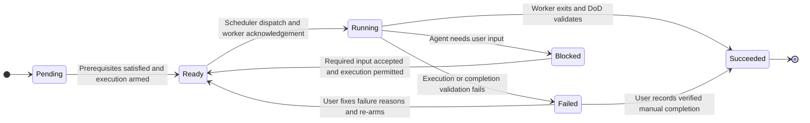
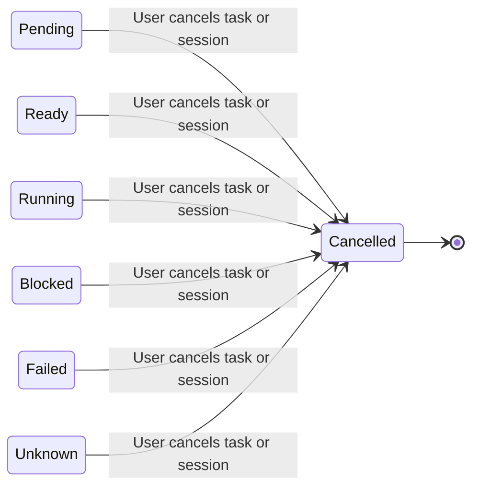
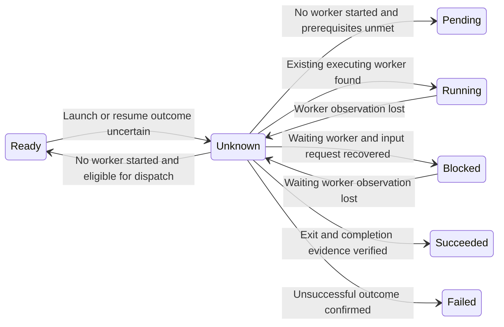

# ITX — Kubernetes-Aligned State Proposal

Status: revised for user review, 2026-09-18. Includes the user's explicit Ready,
Blocked, and Cancelled states. No implementation or acceptance changes are authorized
by this proposal. Kubernetes research was delegated to a subagent at the user's request.

## What Kubernetes actually names

Kubernetes has five Pod phases: **Pending, Running, Succeeded, Failed, Unknown**.
`Ready` is a condition, not a phase, and means ready to serve requests—not ready
to be launched. Container states are separately Waiting, Running, and Terminated.
`Terminating` and `CrashLoopBackOff` can appear in kubectl STATUS but are not Pod
phases. Pod phases are coarse summaries, not an exhaustive state-transition graph.

| Kubernetes phase | Meaning | Typical outgoing transition / trigger |
|---|---|---|
| Pending | Accepted; containers are not fully set up. Includes scheduling and startup preparation. | Running when startup meets the running definition; Failed on definitive startup failure without restart. Unmet prerequisites can leave it Pending. |
| Running | Bound to a node, containers created, and at least one is running, starting, or restarting. | Succeeded when all finish successfully without further restart; Failed on final unsuccessful termination/system failure. Container restarts can leave the phase Running. |
| Succeeded | All containers terminated successfully and will not restart. | Terminal for that Pod identity; further execution uses a new Pod. Deletion is separate. |
| Failed | Containers terminated and at least one failed, with no further restart; also used in system failure handling. | Terminal for that Pod identity; further execution uses a new Pod. Deletion is separate. |
| Unknown | The Pod's state cannot be obtained, commonly because of communication failure. | Observation/controller action resolves its state. The documentation does not specify a universal timeout or mandatory next phase. |

A Pod has no Paused, Blocked, Ready, or Cancelled phase. Deletion requests shutdown;
it does not prove a process has stopped, and a deleted Pod can end Succeeded or
Failed depending on execution outcomes. ITX must separately retain user intent.

Official sources:
- [Pod lifecycle and phases](https://kubernetes.io/docs/concepts/workloads/pods/pod-lifecycle/#pod-phase)
- [Container states](https://kubernetes.io/docs/concepts/workloads/pods/pod-lifecycle/#container-states)
- [Pod conditions](https://kubernetes.io/docs/concepts/workloads/pods/pod-condition/)
- [Scheduling gates](https://kubernetes.io/docs/concepts/scheduling-eviction/pod-scheduling-readiness/)
- [Init-container failure](https://kubernetes.io/docs/concepts/workloads/pods/init-containers/#understanding-init-containers)
- [Termination](https://kubernetes.io/docs/concepts/workloads/pods/pod-lifecycle/#pod-termination-flow)

## Proposed ITX taxonomy

Use **Pending, Ready, Running, Blocked, Succeeded, Failed, Cancelled, Unknown**.
Ready, Blocked, and Cancelled are explicit ITX extensions to the Kubernetes vocabulary,
required by the user. They are lifecycle states, not merely conditions or controls.

- **Pending** waits for prerequisites; **Ready** can be picked up by the scheduler.
- **Blocked** means the agent needs user input and cannot proceed. Ordinary dependency
  or capacity waits are not Blocked.
- **Cancelled** records intentional abandonment, including session cancellation.
- Retain Active/Suspended control only for the separate user pause/re-arm behavior.
  Cancellation is represented by the Cancelled phase, not a duplicate control value.

### State transition diagram

The main execution and user-recovery paths are shown below. Cancellation and
uncertain-worker recovery are separated for readability; the table defines all
outgoing transitions, including startup failures and withdrawn eligibility.

**Cancellation:** a user cancelling a session cancels every unfinished child.
Succeeded children remain Succeeded. Cancelled has no outgoing lifecycle transition;
worker shutdown is reconciled separately.

**Unknown:** reconciliation restores the state established by evidence; it never
authorizes a duplicate worker or an automatic retry of failed execution.

### Task phase meanings and all proposed outgoing transitions

| Phase | Meaning in ITX | Possible next phase and trigger |
|---|---|---|
| **Pending** | Registered but prerequisites or execution permission are not yet satisfied. Includes dependency waits and work explicitly awaiting re-arm. Not dispatchable. | **Ready**: dependencies and required inputs are available, parent permits execution, and work is armed. **Failed**: definitive prerequisite/setup error. **Cancelled**: explicit task/session cancellation. No direct Pending → Running. |
| **Ready** | Eligible for the scheduler to pick up. May wait here for scheduler capacity; a persisted launch/resume reservation prevents duplicate dispatch. | **Running**: scheduler dispatches and worker acknowledges startup/resumption. **Pending**: prerequisite or execution permission is withdrawn before dispatch. **Failed**: definitive preparation/launch failure. **Unknown**: launch/resume outcome is uncertain. **Cancelled**: explicit task/session cancellation. |
| **Running** | Current worker has acknowledged startup/resumption and is executing. | **Blocked**: agent reports a required user-input request and cannot proceed. **Succeeded**: worker stops and DoD plus commit/branch/PR validate. **Failed**: unsuccessful exit, invalid final artifacts, or confirmed suspension interruption. **Unknown**: execution can no longer be established. **Cancelled**: explicit task/session cancellation. |
| **Blocked** | Agent is waiting for required user input and cannot move forward. Persist the question/request and its task/attempt identity. Not dispatchable. | **Ready**: required input is supplied and accepted, execution is armed, and parent/prerequisites permit resumption. Remains Blocked if the response is incomplete or admission is still disabled. **Failed**: definitive worker/protocol failure. **Unknown**: waiting worker status becomes uncertain. **Cancelled**: explicit task/session cancellation. No direct Blocked → Running. |
| **Succeeded** | DoD met; durable commit, branch, and PR recorded; no active worker. This replaces `done`, without changing its required evidence. | None for this completed task. Approval and cleanup are separate operations, not phase transitions. |
| **Failed** | Definitive failed startup/execution/validation or confirmed suspension interruption. Never automatically retried. Cancellation is Cancelled, not Failed. | **Ready**: user fixes the failure reasons and explicitly re-arms execution, previous execution is confirmed stopped, and prerequisites/parent permission are satisfied. Otherwise remains Failed with unresolved reasons recorded. Scheduler dispatch starts a new attempt. **Succeeded**: explicit audited resolution with valid completion evidence and no active worker. **Cancelled**: explicit abandonment, including parent cancellation. Retain failed attempt history. |
| **Cancelled** | User abandoned the task or its parent session. Scheduler admission is revoked immediately and any existing worker must be stopped. | None. Terminal even while physical shutdown is being reconciled; track stop acknowledgement separately. Late worker reports cannot restore Running or Succeeded. |
| **Unknown** | ITX cannot establish an attempted launch/resume or worker outcome. Store the last confirmed phase and reason; do not launch a duplicate. | **Pending/Ready**: reconciliation proves no worker started, according to current eligibility. **Running**: existing executing worker found. **Blocked**: waiting worker and its input request recovered. **Succeeded/Failed**: definitive outcome verified. **Cancelled**: explicit cancellation; continue reconciling/terminating the old worker. No blind retry on elapsed time alone. |

The logical task can be explicitly repaired. Its **execution attempts** retain
terminal Succeeded/Failed/Cancelled outcomes. Re-arm creates a
new attempt, analogous to replacement rather than resetting a terminal Pod. Manual
task resolution records an override/result; it does not pretend its failed worker
succeeded. Kubernetes-style names do not imply Kubernetes's automatic restarts.

Cancellation commits Cancelled immediately, with `stop_requested` and confirmed
worker exit recorded separately. It is not an execution failure and does not grant
cleanup approval. A cancellation after committed Succeeded cannot erase success.

For Blocked, persist the input request and suspend execution at a wrapper-controlled
boundary. Supplying input only makes the task Ready; the scheduler authorizes resume.
It may resume the same parked worker, or create a new attempt after the prior worker
is confirmed stopped. Never spawn a second worker while the first is still live.
Startup/resume acknowledgement commits Running before any subsequent completion,
even if a fast worker's receipts are processed in one tick.

### Control meanings and outgoing transitions

| Control | Meaning | Possible next control and trigger |
|---|---|---|
| **Active** | User permits execution; only Ready work can be dispatched when capacity is available. | **Suspended**: explicit pause or parent suspension/failure policy. |
| **Suspended** | No launches/resumes; request stop of an active worker. No automatic resume when dependencies are repaired. | **Active**: explicit user re-arm after prior worker stop is confirmed. Re-evaluate prerequisites and pass through Ready before Running. Cannot re-arm Cancelled work. |

Examples:

| Situation | Phase | Control | Reason/condition |
|---|---|---|---|
| Waiting for A's output | Pending | Active | reason=DependencyIncomplete |
| All prerequisites satisfied, capacity unavailable | Ready | Active | reason=CapacityUnavailable |
| Agent asks a required question | Blocked | Active | Persisted input request; execution parked |
| User supplies the required input | Ready | Active | Await scheduler-authorized resume |
| User pauses before launch | Pending | Suspended | reason=UserSuspended |
| User pauses a live worker | Running | Suspended | Stopping=True |
| That worker confirms interruption | Failed | Suspended | reason=Suspended; Stopping=False |
| User fixes failure reasons and re-arms the stopped task | Ready | Active | Eligible for scheduler pickup; next dispatch uses a new attempt ID |
| User cancels before any launch | Cancelled | — | No worker to stop |
| User cancels a live worker | Cancelled | — | Stopping=True until exit confirmed |
| Worker disappears without reliable exit evidence | Unknown | Unchanged | reason=WorkerObservationLost |

Dependency waits use Pending with a reason. Capacity waits use Ready. A parent pause
withdraws admission; it does not manufacture a user-input request on each child.
Blocked is reserved for an actual unanswered request or its unresolved admission
guards. A supplied answer remains recorded while a separate parent pause is resolved.

### Session meanings and transitions

Sessions use the same phase/control vocabulary but aggregate orchestration rather
than describing a single worker. A session is not a Pod; these are ITX semantics.

| Session phase | Meaning | Possible next phase and trigger |
|---|---|---|
| **Pending** | Registered but prerequisites or parent/user permission prevent admission. | **Ready** when armed and prerequisites are satisfied; **Failed** on definitive prerequisite error; **Cancelled** on user cancellation. |
| **Ready** | Session is eligible for the global scheduler to start/resume orchestration. | **Running** on acknowledged start/resume; **Pending** if eligibility is withdrawn; **Failed** on launch error; **Unknown** on ambiguous dispatch; **Cancelled** on user cancellation. |
| **Running** | Session orchestration is active, including task execution and ordered integration. | **Blocked** when required user input prevents session progress; **Succeeded** when all required tasks and session output validate; **Failed** when failure/suspension is reconciled and affected work has stopped; **Unknown** when execution/integration outcome is uncertain; **Cancelled** on user cancellation. |
| **Blocked** | Session cannot proceed without user input, from the orchestrator or required blocked children. | **Ready** after required input is resolved and execution is permitted; **Failed** on definitive execution failure; **Unknown** on loss of execution observation; **Cancelled** on user cancellation. Resume always passes Ready. |
| **Succeeded** | Required task results and final session output are durable; no active work remains. | None. Approval/cleanup remain separate. |
| **Failed** | Session execution failed or was suspended; reasons and child histories retained. | **Ready** after user fixes failure reasons and explicitly re-arms the session/subtree, affected prior execution is stopped, and scheduling prerequisites are satisfied; otherwise remains Failed. **Succeeded** only through explicit audited resolution after required child/session evidence validates; **Cancelled** on user abandonment. Never synthesize successful children. |
| **Cancelled** | User cancelled the session; all unfinished children are cancelled and active work is being stopped. | None. Preserve successful outputs and all attempt history. Physical termination and cleanup are separate. |
| **Unknown** | Session execution/integration outcome cannot be determined reliably. | **Pending**, **Ready**, **Running**, **Blocked**, **Succeeded**, or **Failed** after reconciliation establishes the facts; **Cancelled** on explicit user cancellation. |

Parent cancellation atomically marks the session and every unfinished child Cancelled,
including Pending, Ready, Running, Blocked, Failed, and Unknown children, and revokes
admission. Parent suspension propagates Suspended control. Worker termination is
reconciled afterward. Preserve Succeeded children and existing Cancelled outcomes.
Track parent versus individual suspension reasons. Explicit subtree re-arm clears
only the selected parent-origin stops; individual pauses/failures require explicit
selection. Answering a blocked task never clears a separate parent suspension.

A blocked child does not automatically make every sibling Blocked. While other
authorized work can progress, the session remains Running. When required user input
prevents further session progress, the session becomes Blocked and references those
requests. Resolving them promotes it to Ready for scheduler-controlled resumption.

The earlier **stop the whole session on first child failure** policy remains a
proposal: suspend parent and other unfinished children, preserve the failed child,
and settle the session Failed once affected execution stops. Other sessions keep
running. Repairing one dependency cannot silently resume a suspended session.

## Review boundary

Review this taxonomy and session-worktree clarification before implementation,
further architectural changes, or acceptance-criteria work. The unchanged completion
contract is commit + branch + PR; cleanup remains approval-gated.
