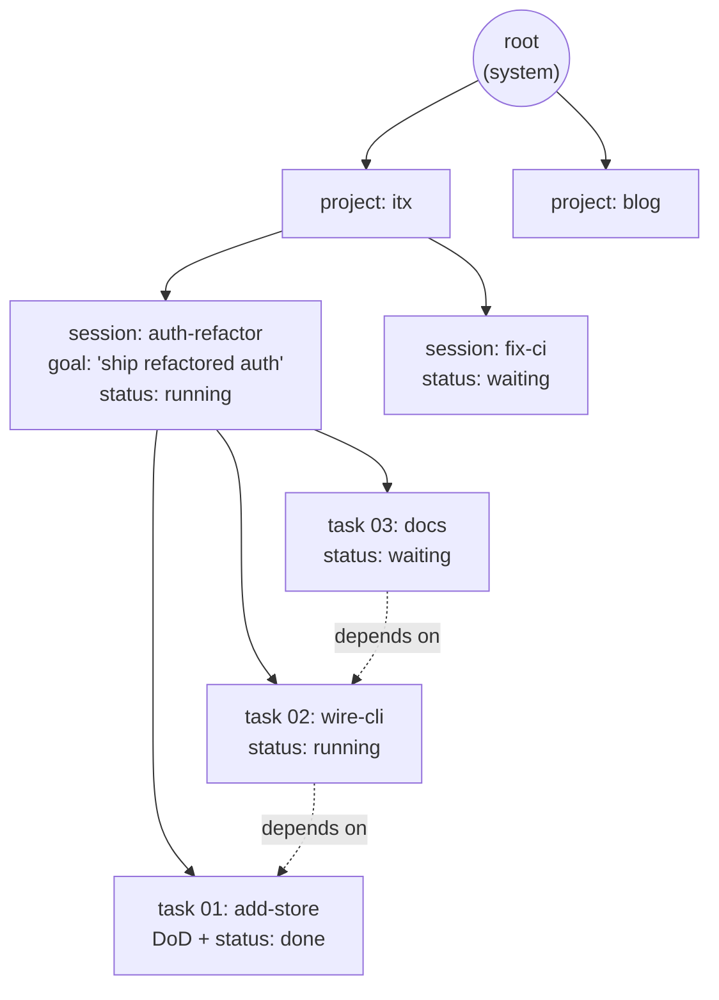
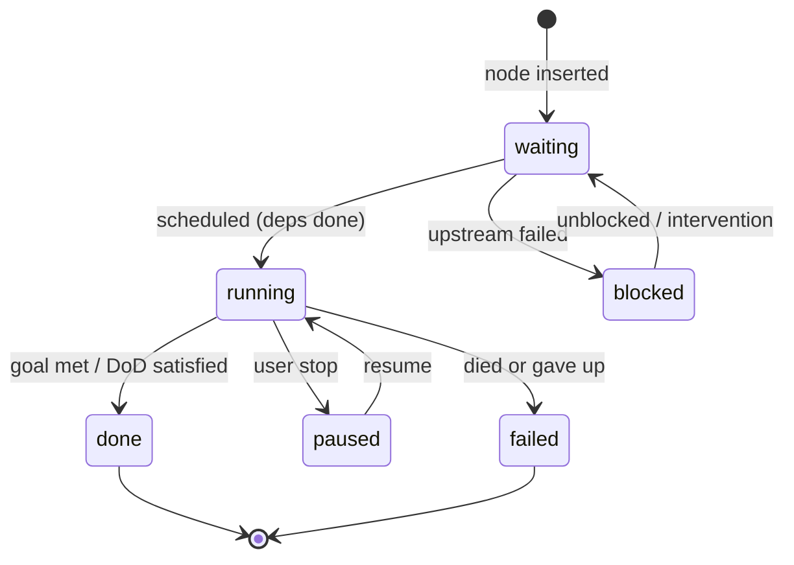
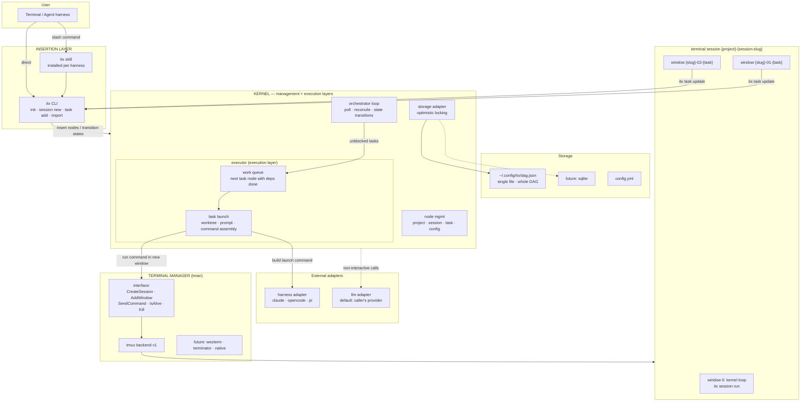
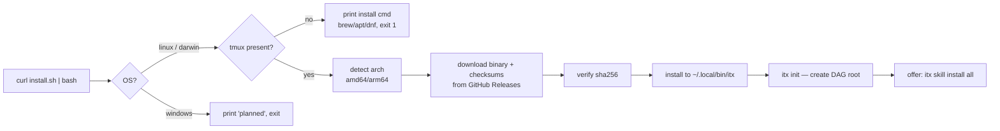
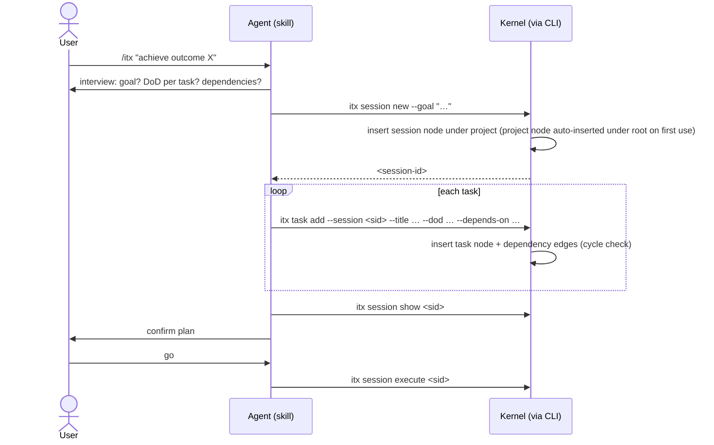
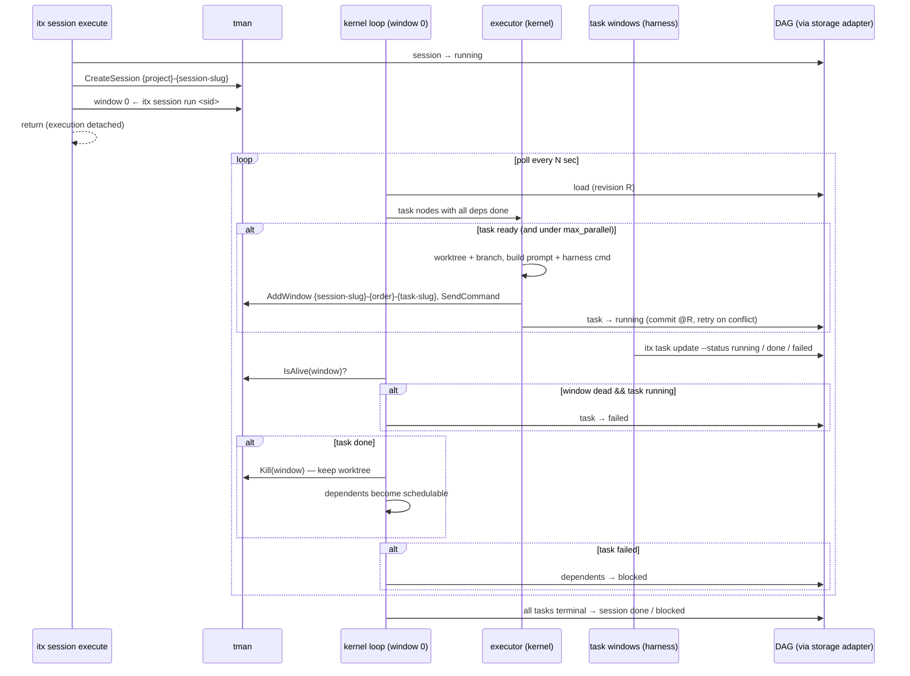
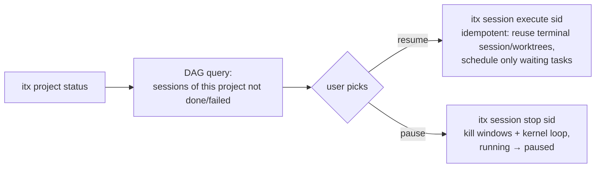

# ITX — Architecture & Design

Terminology: see [DOMAIN.md](DOMAIN.md). Requirements: see [req.md](req.md).

## The core idea

The entire system is a **DAG stored in one file per installation**. The root node is
the system, created at install/init. Projects are children of the root; sessions
(user objectives) are children of projects; tasks (sub-objectives) are children of
sessions, with dependency edges between sibling tasks. Everything else is one of
three layers operating on this data structure:

- **Insertion layer** — adds nodes (init, session new, task add, bulk import)
- **Management layer** — the kernel: state transitions, queries, reconciliation,
  optimistic-locking commits
- **Execution layer** — materializes `running` task nodes into harness sessions in
  terminal windows (executor → harness adapter → tman)

Scaling stays deterministic because scheduling is a pure function of the DAG: same
graph, same decisions, regardless of how many sessions and tasks exist.

## The DAG



Solid edges = hierarchy (child). Dotted edges = task dependency. Sessions correlate
1:1 with harness sessions; tasks correlate with the subtasks the harness works
through.

## State machine (sessions and tasks share it)



`done` and `failed` are terminal. A `failed` task cascades `blocked` to its
dependents; the session goes `blocked` (or `failed` if nothing can proceed).

## High-level product diagram



Component boundaries:

- **Kernel** — implements the management layer and owns the execution layer.
  Orchestrator loop + executor + node management + storage adapter. Sole writer of
  the DAG. Deterministic. Touches terminals only through tman, harnesses only
  through the harness adapter.
- **Executor (kernel subcomponent)** — decides which task node runs next: owns the
  work queue, then materializes each scheduled task (worktree, prompt, harness
  command via the harness adapter) and runs it through the tman interface.
- **Storage adapter** — narrow load/commit interface with optimistic locking. v1:
  single JSON file. Swappable to sqlite with minimal effort; no kernel changes.
- **tman (terminal manager)** — narrow interface (`CreateSession`, `AddWindow`,
  `SendCommand`, `IsAlive`, `Kill`); tmux is the only v1 backend; wezterm/terminator/
  native terminals slot in behind the same interface later.
- **Harness adapter** — command construction for claude / opencode / pi.
- **LLM adapter** — direct non-interactive LLM calls (slug generation, summaries,
  failure triage). Defaults to the caller's harness provider; overridable in config.

## Key workflows

### 1. Install + init



### 2. Plan a session (insertion layer)



### 3. Execute / orchestrate (management + execution layers)



### 4. Resume / pause



## Storage

### Storage adapter interface

```go
type Revision uint64

type Store interface {
    Load(ctx context.Context) (*DAG, Revision, error)
    // Commit persists the DAG iff the stored revision still equals expected.
    // Returns ErrConflict otherwise; caller re-loads, re-applies, retries.
    Commit(ctx context.Context, dag *DAG, expected Revision) error
}
```

Optimistic locking: every writer follows load → mutate → commit-at-revision; on
`ErrConflict` it re-loads and retries. The JSON backend implements Commit with an
exclusive flock + revision check + write-temp-then-rename, so writes are atomic and
predictable under N concurrent task windows. A sqlite backend implements the same
interface with a transaction — no kernel changes.

### `~/.config/itx/dag.json` (single file per installation)

```json
{
  "revision": 42,
  "nodes": [
    { "id": "root", "type": "root", "created_at": "2026-09-17T09:00:00Z" },
    {
      "id": "p-itx", "type": "project",
      "name": "itx", "slug": "itx",
      "dir": "/home/devashish/workspace/ric03uec/itx",
      "created_at": "…"
    },
    {
      "id": "s-20260917-a1b2", "type": "session",
      "slug": "auth-refactor",
      "goal": "ship refactored auth with tests",
      "status": "running",
      "harness": "claude", "model": "",
      "created_at": "…", "started_at": "…", "finished_at": ""
    },
    {
      "id": "t-c3d4", "type": "task",
      "order": 1, "slug": "add-store",
      "title": "Add store package",
      "goal": "storage adapter package",
      "definition_of_done": "adapter with optimistic locking; unit tests pass",
      "status": "done",
      "isolation": "worktree",
      "harness": "", "model": "",
      "worktree": "/home/…/itx-auth-refactor-add-store",
      "branch": "itx/auth-refactor/add-store",
      "window": "auth-refactor-01-add-store",
      "created_at": "…", "started_at": "…", "finished_at": "…",
      "notes": ""
    }
  ],
  "edges": [
    { "from": "root",             "to": "p-itx",            "type": "child" },
    { "from": "p-itx",            "to": "s-20260917-a1b2",  "type": "child" },
    { "from": "s-20260917-a1b2",  "to": "t-c3d4",           "type": "child" },
    { "from": "t-e5f6",           "to": "t-c3d4",           "type": "dependency" }
  ]
}
```

Rules:
- `root` is created once by `itx init`; project nodes are inserted on first use in a
  directory; the graph is append-mostly (nodes are never re-parented).
- Statuses per the shared state machine: `waiting | running | paused | blocked |
  done | failed`; only session and task nodes carry status.
- `dependency` edges only between tasks of the same session; cycle-checked on insert.
- Per-task `harness`/`model` empty ⇒ inherit session ⇒ config ⇒ auto-detect.
- "Active work" is a query (sessions not `done`/`failed`), not a separate file.

### `~/.config/itx/config.yml`

```yaml
default_harness: ""        # "" → auto-detect PATH: claude → opencode → pi
max_parallel: 0            # 0 = unlimited
poll_interval_seconds: 30
terminal: tmux             # tman backend; only tmux in v1
storage: json              # storage adapter backend; sqlite later
harnesses:                 # command templates; user-fixable without a new binary
  claude:   'claude --dangerously-skip-permissions {{prompt}}'
  opencode: 'opencode {{prompt}}'
  pi:       'pi {{prompt}}'
llm:                       # LLM adapter override; empty → caller's provider
  provider: ""
  model: ""
```

## CLI surface

```
itx init                                 # create DAG root (run once, by installer)
itx session new [--goal G] [--from manifest.json] [--slug S] [--harness X] [--model Y]
itx session show <id>                    # session node + task subtree (the manifest)
itx session update <id> --status [waiting|running|paused|blocked|done|failed]
itx session execute <id> [--harness X] [--model Y]
itx session stop <id>                    # running → paused
itx session run <id>                     # hidden; kernel loop (window 0)
itx task add --session <id> --title T --dod D [--depends-on a,b] [--json '{…}']
itx task update --session <id> <task-slug> [--status S] [--json '{…}']
itx project status                       # DAG query: this project's non-terminal sessions
itx skill install [claude|opencode|pi|all]
itx skill update
itx config get <key> | set <key> <value>
itx version
```

## tman interface

```go
type TerminalManager interface {
    CreateSession(name string) error            // idempotent
    HasSession(name string) bool
    AddWindow(session, window, dir string) error
    SendCommand(session, window, cmd string) error
    IsAlive(session, window string) bool
    KillWindow(session, window string) error
    KillSession(name string) error
}
```

v1: `tmuxBackend` implements this with `tmux new-session / new-window / send-keys /
list-windows / kill-window / kill-session`. Backend chosen by `terminal:` in
config.yml; adding wezterm/terminator/native = new implementation, no caller changes.

## Package layout

```
cmd/itx/main.go
internal/cli/        # cobra command wiring only (insertion + query surface)
internal/kernel/     # THE core: orchestrator loop, state machine, node mgmt,
                     # dep resolution, reconciler, config mgmt
internal/kernel/executor/  # work queue: next task node with deps done; task
                           # materialization (worktree, prompt, launch via tman)
internal/kernel/store/     # storage adapter interface + JSON backend (OCC);
                           # future: sqlite backend
internal/tman/       # TerminalManager interface + tmux backend
internal/harness/    # harness adapters + PATH auto-detect
internal/llm/        # LLM adapter (caller-default, config override)
internal/gitx/       # git helpers: toplevel, slug, worktree add/remove
skills/itx/SKILL.md            # go:embed → itx skill install
skills/itx-release/SKILL.md
install.sh
.github/workflows/{ci,release}.yml
archived/skills/     # former GitHub-workflow skills (reference only)
```

## Design decisions

| Decision | Choice | Why |
|---|---|---|
| Core data structure | single DAG: root → projects → sessions → tasks (+ dependency edges) | scheduling is a pure function of the graph — deterministic scaling as work grows |
| Storage | one file per installation (`dag.json`), optimistic locking, behind a storage adapter | predictable concurrent writes; human-readable v1; sqlite swap without kernel changes |
| State model | shared 6-state machine (waiting/running/paused/blocked/done/failed) for sessions and tasks | one transition diagram to reason about; failed vs blocked separates terminal from recoverable |
| CLI language | Go, static binary | curl-install from GH Releases; real JSON; clean Windows path later |
| Core shape | single kernel (loop + executor/work queue + node mgmt + storage adapter) | one writer, one source of truth |
| Terminal access | tman interface, tmux backend v1 | swap in wezterm/terminator/native without touching kernel |
| Parallelism | 1 terminal session / itx session; 1 window / task | watchable, killable, survives terminal close |
| Kernel loop home | window 0 of the terminal session | no daemon plumbing; user-visible; deterministic Go loop |
| Isolation | git worktree + branch per task | parallel edits can't collide; merge is explicit |
| Status truth | tasks report via CLI + kernel reconciles | robust to children forgetting; dead window → failed |
| Concurrency | unlimited default, `max_parallel` opt-in | user asked for max parallelism by default |
| LLM calls | separate LLM adapter, defaults to caller's provider | keeps kernel deterministic; direct calls isolated and overridable |
| Skill distribution | embedded in binary, `itx skill install` | skill version always matches binary |
| Releases | atx model: push v-X.Y → CI tags YY.MM.PP + binaries | proven pipeline; installer reads GH Releases |
| Windows | stubs + interfaces only | requirement: structure for it, don't build it |
