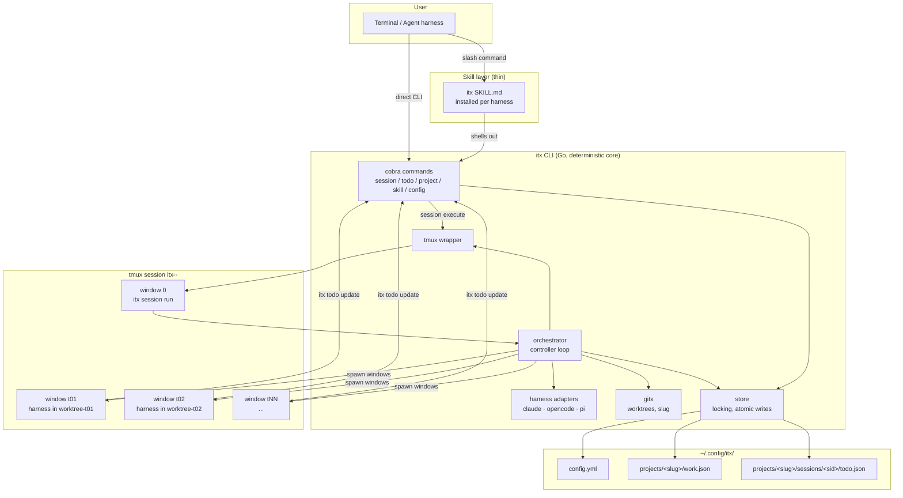
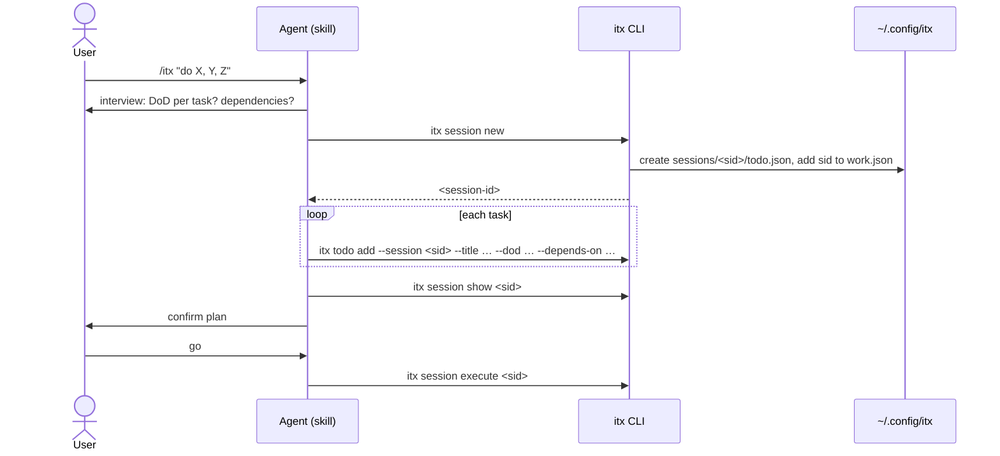
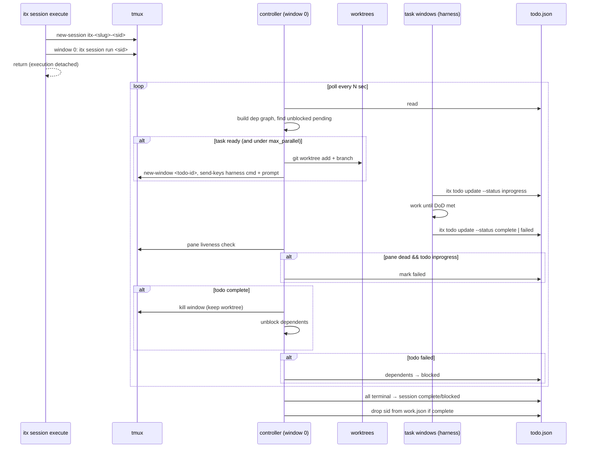
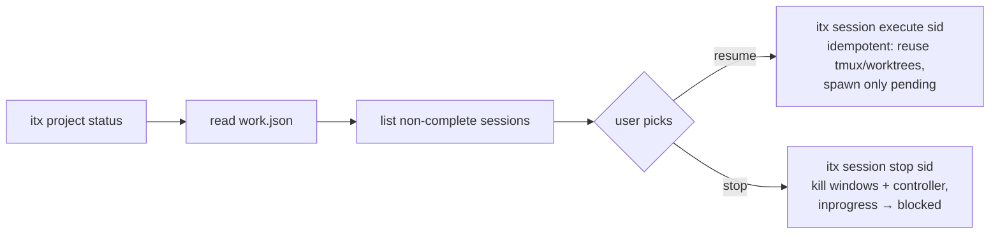

# ITX — Architecture & Design

## High-level product diagram



Two consumers, one core: the skill and the human both talk to the same CLI; the CLI is
the only writer of state files.

## Key workflows

### 1. Install

```mermaid
flowchart LR
    A[curl install.sh \| bash] --> B{OS?}
    B -->|linux / darwin| C{tmux present?}
    B -->|windows| Z[print 'planned', exit]
    C -->|no| Y[print install cmd<br/>brew/apt/dnf, exit 1]
    C -->|yes| D[detect arch<br/>amd64/arm64]
    D --> E[download binary + checksums<br/>from GitHub Releases]
    E --> F[verify sha256]
    F --> G[install to ~/.local/bin/itx]
    G --> H[warn if not on PATH]
    H --> I[offer: itx skill install all]
```

### 2. Plan a session (skill-driven or manual)



### 3. Execute / orchestrate



### 4. Resume / stop



## State files

### `~/.config/itx/config.yml`

```yaml
default_harness: ""        # "" → auto-detect PATH: claude → opencode → pi
max_parallel: 0            # 0 = unlimited
poll_interval_seconds: 30
harnesses:                 # command templates; user-fixable without a new binary
  claude:   'claude --dangerously-skip-permissions {{prompt}}'
  opencode: 'opencode {{prompt}}'
  pi:       'pi {{prompt}}'
```

### `~/.config/itx/projects/<slug>/work.json`

```json
{ "active_sessions": ["s-20260917-a1b2"] }
```

Only sessions **not** in `complete` state. Slug = sanitized basename of
`git rev-parse --show-toplevel` (fallback: cwd basename), disambiguated with a short
path-hash suffix on collision.

### `~/.config/itx/projects/<slug>/sessions/<sid>/todo.json`

```json
{
  "session_id": "s-20260917-a1b2",
  "project": "itx",
  "project_dir": "/home/devashish/workspace/ric03uec/itx",
  "status": "inprogress",
  "harness": "claude",
  "model": "",
  "created_at": "2026-09-17T10:00:00Z",
  "updated_at": "2026-09-17T10:12:00Z",
  "todos": [
    {
      "id": "t01",
      "title": "Add store package",
      "definition_of_done": "store package with locking; unit tests pass",
      "depends_on": [],
      "status": "complete",
      "isolation": "worktree",
      "harness": "",
      "model": "",
      "worktree": "/home/…/itx-a1b2-t01",
      "branch": "itx/a1b2/t01",
      "created_at": "…",
      "started_at": "…",
      "finished_at": "…",
      "notes": ""
    },
    {
      "id": "t02",
      "title": "…",
      "definition_of_done": "…",
      "depends_on": ["t01"],
      "status": "pending",
      "isolation": "worktree",
      "harness": "", "model": "",
      "worktree": "", "branch": "",
      "created_at": "…", "started_at": "", "finished_at": "",
      "notes": ""
    }
  ]
}
```

Rules:
- `todos` kept in dependency (topological) order.
- Statuses: `pending | inprogress | blocked | complete | failed` (sessions and todos).
- Per-todo `harness`/`model` empty ⇒ inherit session ⇒ inherit config ⇒ auto-detect.
- All writes: exclusive file lock + write-temp-then-rename (controller and N children
  write concurrently).

## CLI surface

```
itx session new [--from todos.json] [--harness X] [--model Y]     # prints session id
itx session show <id>
itx session update <id> --status [inprogress|pending|blocked|complete|failed]
itx session execute <id> [--harness X] [--model Y]
itx session stop <id>
itx session run <id>                     # hidden; controller loop (window 0)
itx todo add --session <id> --title T --dod D [--depends-on a,b] [--json '{…}']
itx todo update --session <id> <todo-id> [--status S] [--json '{…}']
itx project status
itx skill install [claude|opencode|pi|all]
itx skill update
itx config get <key> | set <key> <value>
itx version
```

## Package layout

```
cmd/itx/main.go
internal/cli/            # cobra command wiring only
internal/store/          # config.yml, work.json, todo.json; lock + atomic write
internal/orchestrator/   # dep graph, spawn planner, reconciler, controller loop
internal/tmux/           # has-session/new-session/new-window/send-keys/pane-liveness
internal/harness/        # adapter interface + claude/opencode/pi; PATH auto-detect
internal/gitx/           # worktree add/remove, toplevel + slug detection
skills/itx/SKILL.md      # go:embed → itx skill install
skills/itx-release/SKILL.md
install.sh
.github/workflows/{ci,release}.yml
archived/skills/         # former GitHub-workflow skills (reference only)
```

## Design decisions

| Decision | Choice | Why |
|---|---|---|
| CLI language | Go, static binary | curl-install from GH Releases; real JSON; clean Windows path later |
| Parallelism | 1 tmux session / itx session; 1 window / task | watchable, killable, survives terminal close |
| Orchestrator home | window 0 of the tmux session | no daemon plumbing; deterministic Go loop; user-visible |
| Isolation | git worktree + branch per task | parallel edits can't collide; merge is explicit |
| Status truth | children report via CLI + controller reconciles | robust to children forgetting; pane death → failed |
| Concurrency | unlimited default, `max_parallel` opt-in | user asked for max parallelism by default |
| Skill distribution | embedded in binary, `itx skill install` | skill version always matches binary |
| Releases | atx model: push v-X.Y → CI tags YY.MM.PP + binaries | proven pipeline; installer reads GH Releases |
| Windows | stubs + interfaces only | requirement: structure for it, don't build it |
