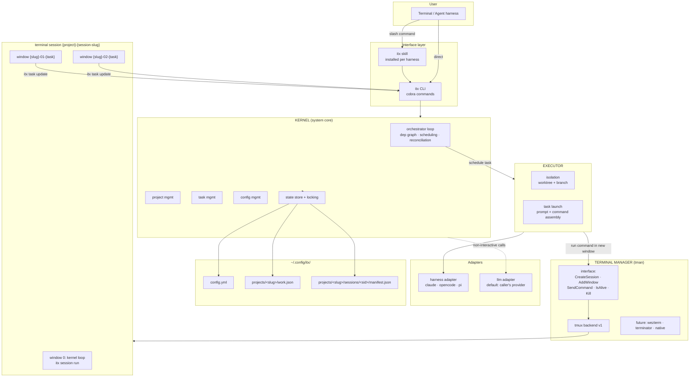
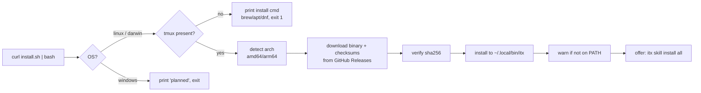
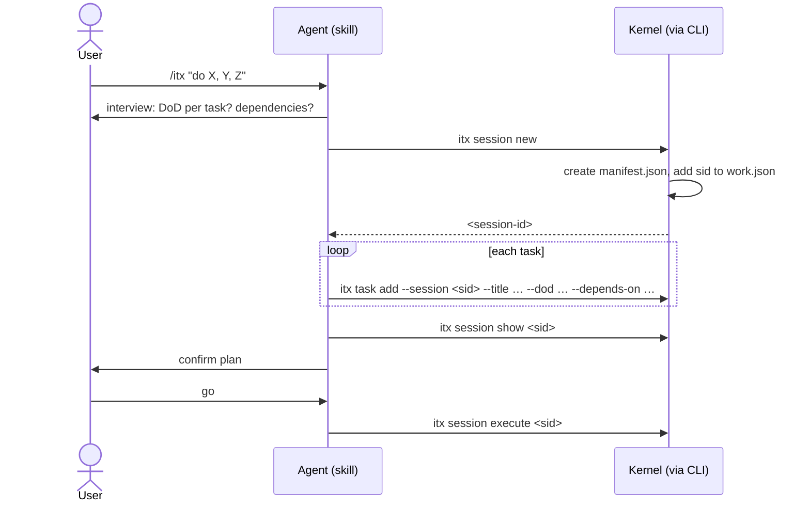
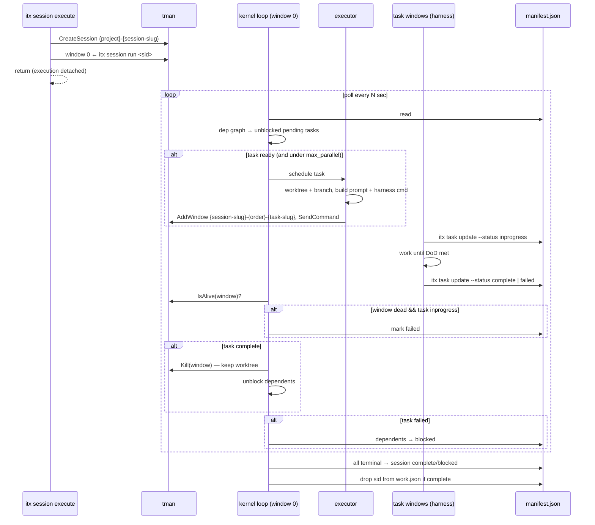

# ITX — Architecture & Design

Terminology: see [DOMAIN.md](DOMAIN.md). Requirements: see [req.md](req.md).

## High-level product diagram



Component boundaries:

- **Kernel** — the system core. Orchestrator loop + state store + locking + project /
  task / config management collapse into this one component. Sole writer of state
  files. Deterministic; no terminal or harness knowledge.
- **Executor** — materializes one scheduled task: worktree, prompt, harness command,
  window request. Stateless between calls.
- **tman (terminal manager)** — narrow interface (`CreateSession`, `AddWindow`,
  `SendCommand`, `IsAlive`, `Kill`); tmux is the only v1 backend; wezterm/terminator/
  native terminals slot in behind the same interface later.
- **Harness adapter** — command construction for claude / opencode / pi.
- **LLM adapter** — direct non-interactive LLM calls (slug generation, summaries,
  failure triage). Defaults to the caller's harness provider; overridable in config.

## Key workflows

### 1. Install



### 2. Plan a session (skill-driven or manual)



### 3. Execute / orchestrate



### 4. Resume / stop


## State files

### `~/.config/itx/config.yml`

```yaml
default_harness: ""        # "" → auto-detect PATH: claude → opencode → pi
max_parallel: 0            # 0 = unlimited
poll_interval_seconds: 30
terminal: tmux             # tman backend; only tmux in v1
harnesses:                 # command templates; user-fixable without a new binary
  claude:   'claude --dangerously-skip-permissions {{prompt}}'
  opencode: 'opencode {{prompt}}'
  pi:       'pi {{prompt}}'
llm:                       # LLM adapter override; empty → caller's provider
  provider: ""
  model: ""
```

### `~/.config/itx/projects/<project-slug>/work.json`

```json
{ "active_sessions": ["s-20260917-a1b2"] }
```

Only sessions **not** in `complete` state. Project slug = sanitized basename of
`git rev-parse --show-toplevel` (fallback: cwd basename), disambiguated with a short
path-hash suffix on collision.

### `~/.config/itx/projects/<project-slug>/sessions/<sid>/manifest.json`

The **session manifest** — everything that needs to be done in the session.

```json
{
  "session_id": "s-20260917-a1b2",
  "session_slug": "auth-refactor",
  "project": "itx",
  "project_dir": "/home/devashish/workspace/ric03uec/itx",
  "status": "inprogress",
  "harness": "claude",
  "model": "",
  "created_at": "2026-09-17T10:00:00Z",
  "updated_at": "2026-09-17T10:12:00Z",
  "tasks": [
    {
      "order": 1,
      "slug": "add-store",
      "title": "Add store package",
      "definition_of_done": "store package with locking; unit tests pass",
      "depends_on": [],
      "status": "complete",
      "isolation": "worktree",
      "harness": "",
      "model": "",
      "worktree": "/home/…/itx-auth-refactor-add-store",
      "branch": "itx/auth-refactor/add-store",
      "window": "auth-refactor-01-add-store",
      "created_at": "…",
      "started_at": "…",
      "finished_at": "…",
      "notes": ""
    },
    {
      "order": 2,
      "slug": "wire-cli",
      "title": "…",
      "definition_of_done": "…",
      "depends_on": ["add-store"],
      "status": "pending",
      "isolation": "worktree",
      "harness": "", "model": "",
      "worktree": "", "branch": "", "window": "",
      "created_at": "…", "started_at": "", "finished_at": "",
      "notes": ""
    }
  ]
}
```

Rules:
- `tasks` kept in dependency (topological) order; `order` is the sorted position.
- Statuses: `pending | inprogress | blocked | complete | failed` (sessions and tasks).
- Per-task `harness`/`model` empty ⇒ inherit session ⇒ config ⇒ auto-detect.
- All writes go through the kernel: exclusive file lock + write-temp-then-rename
  (kernel loop and N task windows write concurrently via the CLI).

## CLI surface

```
itx session new [--from manifest.json] [--slug S] [--harness X] [--model Y]   # prints session id
itx session show <id>
itx session update <id> --status [inprogress|pending|blocked|complete|failed]
itx session execute <id> [--harness X] [--model Y]
itx session stop <id>
itx session run <id>                     # hidden; kernel loop (window 0)
itx task add --session <id> --title T --dod D [--depends-on a,b] [--json '{…}']
itx task update --session <id> <task-slug> [--status S] [--json '{…}']
itx project status
itx skill install [claude|opencode|pi|all]
itx skill update
itx config get <key> | set <key> <value>
itx version
```

## tman interface

```go
type TerminalManager interface {
    CreateSession(name string) error            // idempotent
    HasSession(name string) bool
    AddWindow(session, window, dir string) error
    SendCommand(session, window, cmd string) error
    IsAlive(session, window string) bool
    KillWindow(session, window string) error
    KillSession(name string) error
}
```

v1: `tmuxBackend` implements this with `tmux new-session / new-window / send-keys /
list-windows / kill-window / kill-session`. Backend chosen by `terminal:` in
config.yml; adding wezterm/terminator/native = new implementation, no caller changes.

## Package layout

```
cmd/itx/main.go
internal/cli/        # cobra command wiring only
internal/kernel/     # THE core: orchestrator loop, state store, locking,
                     # project mgmt, task mgmt, config mgmt, dep graph, reconciler
internal/executor/   # task materialization: isolation (worktree), prompt, launch
internal/tman/       # TerminalManager interface + tmux backend
internal/harness/    # harness adapters + PATH auto-detect
internal/llm/        # LLM adapter (caller-default, config override)
internal/gitx/       # git helpers: toplevel, slug, worktree add/remove
skills/itx/SKILL.md            # go:embed → itx skill install
skills/itx-release/SKILL.md
install.sh
.github/workflows/{ci,release}.yml
archived/skills/     # former GitHub-workflow skills (reference only)
```

## Design decisions

| Decision | Choice | Why |
|---|---|---|
| CLI language | Go, static binary | curl-install from GH Releases; real JSON; clean Windows path later |
| Core shape | single kernel (loop + store + locking + project/task/config mgmt) | one writer, one source of truth, deterministic scheduling |
| Terminal access | tman interface, tmux backend v1 | swap in wezterm/terminator/native without touching kernel/executor |
| Parallelism | 1 terminal session / itx session; 1 window / task | watchable, killable, survives terminal close |
| Kernel loop home | window 0 of the terminal session | no daemon plumbing; user-visible; deterministic Go loop |
| Isolation | git worktree + branch per task | parallel edits can't collide; merge is explicit |
| Status truth | tasks report via CLI + kernel reconciles | robust to children forgetting; dead window → failed |
| Concurrency | unlimited default, `max_parallel` opt-in | user asked for max parallelism by default |
| LLM calls | separate LLM adapter, defaults to caller's provider | keeps kernel deterministic; direct calls isolated and overridable |
| Skill distribution | embedded in binary, `itx skill install` | skill version always matches binary |
| Releases | atx model: push v-X.Y → CI tags YY.MM.PP + binaries | proven pipeline; installer reads GH Releases |
| Windows | stubs + interfaces only | requirement: structure for it, don't build it |
