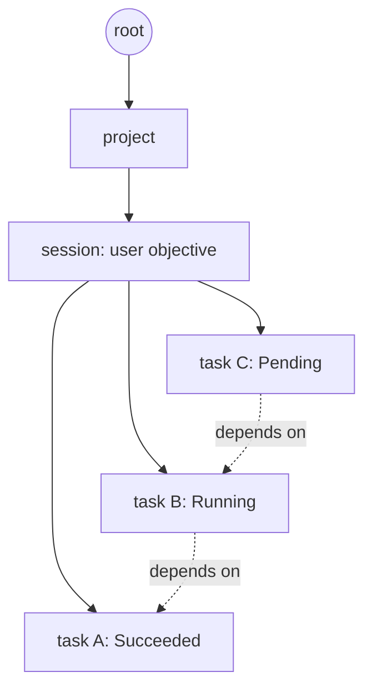
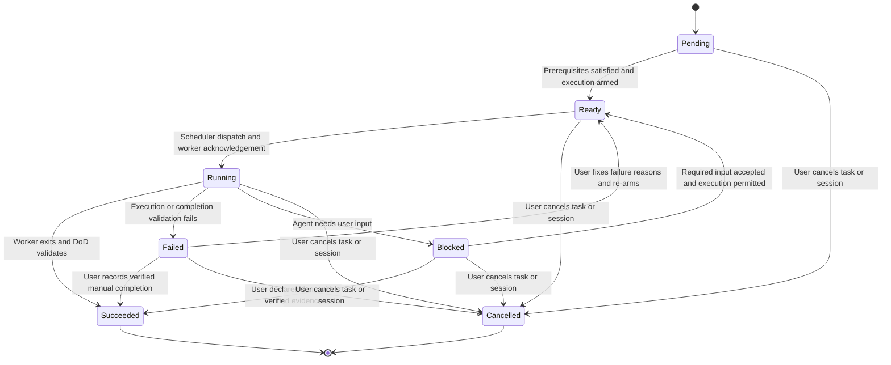
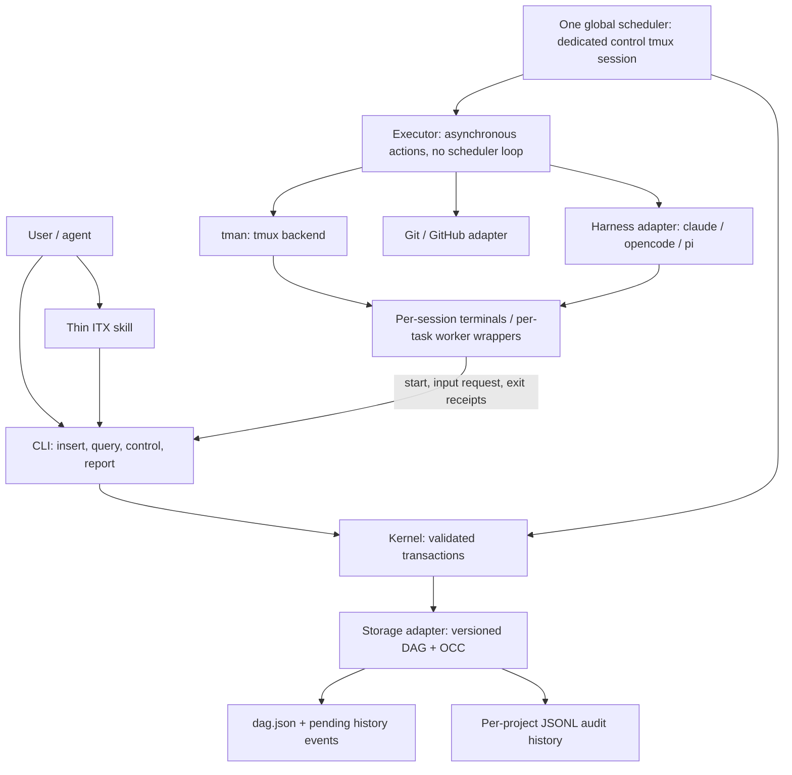
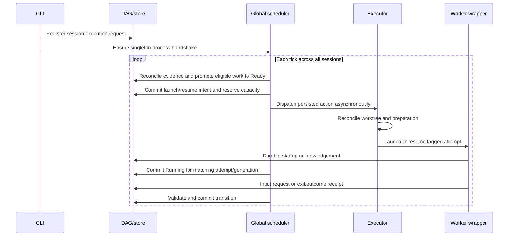
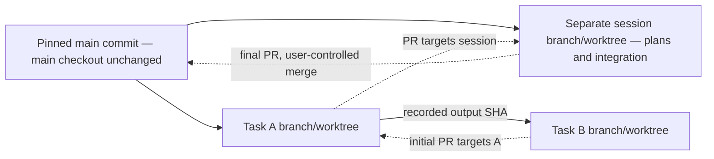

# ITX — Architecture & Design

Terminology: [DOMAIN.md](DOMAIN.md). Requirements: [req.md](req.md).
Implementation order: [execution.md](execution.md). Verification: [uat.md](uat.md).
User prompts and decision history: [CHANGELOG.md](CHANGELOG.md).

## The core idea

The entire system is a **DAG stored in one file per installation**. The root node is
the system; projects are children of the root, sessions are user objectives, and
tasks are sub-objectives with dependency edges between sibling tasks.

- **Insertion layer** adds nodes through the CLI: init, session new, task add/import.
- **Management layer** owns transitions, queries, reconciliation, and transactional writes.
- **Execution layer** dispatches Ready work through the executor, harness adapter,
  worker wrapper, and terminal manager (tman).

One installation-wide scheduler makes deterministic decisions from durable state,
configuration, and recorded observations. LLM calls are outside scheduling logic.
Sessions register work with this scheduler; they never start their own loops.



## State transitions

Sessions and tasks use **Pending, Ready, Running, Blocked, Succeeded, Failed,
Cancelled**. Persist lowercase values (`pending`, `ready`, etc.) in the
DAG and CLI. The diagram shows normal execution, user recovery, and cancellation
together. The table also specifies preparation failures and observation recovery.



### Task state meanings and transition triggers

| State | Meaning | Possible next states and triggers |
|---|---|---|
| **Pending** | Registered, but prerequisites or execution permission are unmet. Dependency waits belong here; cannot be scheduled. | **Ready** when dependencies, inputs, and execution permission are satisfied. **Failed** on definitive prerequisite/setup error. **Cancelled** on task/session cancellation. Never directly Running. |
| **Ready** | Scheduler can pick up the task. May wait for capacity; a durable launch/resume reservation prevents duplicate dispatch. | **Running** after scheduler dispatch and worker startup/resume acknowledgement. **Pending** if eligibility is withdrawn before dispatch. **Failed** on preparation/launch failure or launch/resume acknowledgement timeout. **Cancelled** on cancellation. |
| **Running** | Worker acknowledged startup/resumption; no subsequent transition has been confirmed. Show last worker observation separately. | **Blocked** when the agent requests required user input and cannot proceed. **Succeeded** after worker exit and validated DoD/commit/branch/PR. **Failed** on execution or completion-validation failure, confirmed suspension interruption, or worker observation timeout. **Cancelled** on cancellation. |
| **Blocked** | Agent needs user input and cannot move forward. Persist the request and attempt identity. | **Ready** when required input is accepted and execution is permitted. **Succeeded** when the user explicitly declares the work done, the same completion evidence validates, and no active worker remains. **Failed** on definitive worker/protocol failure or parked-worker observation timeout. **Cancelled** on cancellation. No direct Running transition. |
| **Succeeded** | DoD satisfied; commit SHA, branch, and PR recorded; no active worker. | None. User approval and cleanup are separate operations. |
| **Failed** | Definitive startup, execution, or validation failure; no automatic retry. | **Ready** once the user fixes failure reasons and explicitly re-arms work, prior execution is stopped, and scheduling prerequisites hold. **Succeeded** on explicit user resolution with validated completion evidence and no active worker. **Cancelled** on abandonment. Otherwise stays Failed. |
| **Cancelled** | User abandoned the task or its session. Admission revoked immediately; any worker must stop. | None. Terminal even while physical termination is being reconciled. Late worker reports cannot restore Running or Succeeded. |

Normal flow is Pending → Ready → Running. Both user-input resolution and failure
repair pass through Ready, leaving dispatch to the scheduler. A fast completion
still records Ready → Running → Succeeded, even within one scheduler tick.

An execution attempt has an immutable ID and retains its terminal outcome. Repairing
a Failed task schedules a new attempt without rewriting failure history. A manual
Blocked/Failed → Succeeded resolution records the user, reason, and evidence; it
does not fabricate a successful worker exit. Revoke/stop any parked worker and
confirm shutdown before committing manual success.

### Blocking, pausing, and parent propagation

- **Blocked is specifically a user-input wait**, not a dependency failure or capacity
  wait. Record the question and response. Park execution at a wrapper-controlled
  boundary; input makes work Ready, then the scheduler authorizes resume. Reuse the
  parked worker or replace it only after confirmed exit; never run two workers.
- User pause is separate `active`/`suspended` control. Suspension revokes admission
  and requests worker stop. Unstarted Ready work returns Pending. A confirmed
  execution interruption becomes Failed with reason Suspended. Explicit re-arm is
  required; never automatically resume because a dependency changed.
- Cancellation atomically sets the session and **every unfinished child** to
  Cancelled, including Pending, Ready, Running, Blocked, and Failed.
  Preserve Succeeded outputs and all attempt history. Track stop requests/exit
  separately; durable cancellation is not proof that an OS process has exited.
- Parent suspension applies to unfinished children. Track individual versus parent
  stop reasons; parent re-arm clears only parent-origin stops. An independently
  paused or failed task needs explicit selection for recovery.
- A blocked child does not manufacture input requests on siblings. A session remains
  Running while authorized work can progress; it becomes Blocked when required user
  input prevents further session progress.
- Proposed first-failure policy, still for review: suspend the session and its other
  unfinished work; retain the failed task; settle the session Failed after affected
  execution stops. Other sessions continue. Repair alone does not clear parent stops.

### Session interpretation

Sessions share the transition table, but describe orchestration rather than one
worker: Pending awaits prerequisites, Ready awaits scheduler admission, Running
includes task work and ordered integration. Missing execution/integration evidence
uses bounded reconciliation of the recorded action, not another lifecycle state.
Blocked means required user input prevents progress.

Blocked → Succeeded and Failed → Succeeded require explicit user resolution plus
validated required child outputs and session commit/branch/PR. A parent completion
command never manufactures successful children. Succeeded requires no active work.
Cancelled forbids future dispatch and continues reconciling worker shutdown.

## Components and scheduler ownership



- **Kernel** owns the state reducer and all validated mutations. CLI processes and
  scheduler use the same transaction contract; the scheduler is the sole dispatcher,
  not the only process writing through the store.
- **Scheduler** holds an installation-wide lock for its lifetime. First execute
  bootstraps it in a dedicated control tmux session and checks a process handshake.
  Concurrent execute calls converge on one owner; session terminals contain no loop.
- Each bounded tick reconciles receipts, applies controls, computes eligibility in
  stable order, and persists intents. Slow preparation, git/PR, and launch actions
  run asynchronously and return outcomes to the same loop. No DAG lock across I/O.
- `max_parallel` is global, including reservations and executing workers; default 0
  means unlimited. Parked workers cannot resume without scheduler capacity admission.
- **Executor** implements actions with immutable IDs and reconciliation; it is not
  another scheduling loop. Pausing one session never stops the scheduler.
- **Harness adapter** supports claude/opencode/pi. Effective precedence: task override
  → execute flag → session setting → config → PATH detection in that order. None
  installed means fail fast. Resolve and persist effective configuration per attempt.
- **LLM adapter** provides optional direct calls for slugs, summaries, and triage using
  the caller's provider/credentials or config override. Never inside scheduling.
- **tman** manages sessions/windows, not worker lifecycle truth. An idle shell is not
  a running agent. The worker wrapper supplies execution evidence.

## Execution and recovery



Before side effects, persist `{action_id, session_id, task_id, attempt_id,
control_generation, input_sha, workspace, effective_launch_config, phase}`.
Internal action phases are reserve → prepare → launch → acknowledge → outcome.

- Wrapper captures startup, harness exit, input requests, stop acknowledgement,
  and completion evidence. Reports carry attempt ID and control generation.
- Cancellation/re-arm fences stale reports. No replacement until the previous
  process is confirmed stopped; ambiguous outcomes are reconciled, never replayed blindly.
- Restart adopts live attempts using the DAG, wrapper receipts, and process evidence.
  A missing window alone does not prove a particular exit outcome. Confirmed failures
  become Failed. Missing evidence retains the last confirmed lifecycle state during
  bounded reconciliation. Record the specific outstanding action, last evidence,
  error, and deadline; expose these in status output without adding a catch-all state.
- An expired launch/resume acknowledgement or worker-observation deadline becomes
  Failed with a concrete reason such as `LaunchAckTimeout`, `ResumeAckTimeout`, or
  `WorkerObservationTimeout`. Fence further execution and request stop. A timeout
  proves the supervision contract failed, not that the worker exited: retain its
  ownership/capacity reservation until shutdown or non-launch is confirmed. A later
  receipt cannot silently recover Failed; user recovery follows the transition table.
  User-input waiting itself has no failure deadline; parked-worker supervision does.
- Use a deterministic, idempotent configured preparation command, recording exit/logs.
  Pass environment explicitly, not from stale tmux environment; record secret
  references, not credentials. Construct argv/prompt files rather than unsafe shell text.
- Recovery promises durable, reconcilable execution state, not uninterrupted work or
  exactly-once arbitrary side effects performed by agents.

## Worktrees, stacked PRs, and durable completion

The session pins an exact main commit and creates **another worktree on its own
branch off main**. It can contain plans and session-owned files alongside integrated
outputs. It is neither main's checkout nor any task's worktree. Main stays clean.



- Root tasks branch from pinned main. Dependent B pins A's recorded output and opens
  its PR against A's branch before A merges. Pass needed session planning files as
  explicit task inputs; do not assume they exist in task worktrees.
- Parent session persists dependency-respecting merge order, PR identities/base/head
  revisions, and merge commits. Retarget dependent PRs as ancestors integrate.
  Persist PR-operation intents and reconcile ambiguous remote outcomes before retry.
- Proposed stack policy: ancestry-preserving merge commits; squash/rebase restacking
  deferred. Proposed fan-in rule: wait for multiple prerequisite outputs to integrate
  into the session branch, then pin that commit. Conflicts needing user input block
  the session. These policies remain for review.
- Every successful task records **DoD + commit SHA + branch + PR**. Manual completion
  from Blocked or Failed requires the same evidence and no active worker.
- Session success requires all required task outputs and integrated session output
  with a final PR against main. Final main merge is user-controlled. Exact task-merge
  authorization remains to be settled; a recorded order is not permission to merge.
- Approval identifies the reviewed revision; changed output invalidates approval.
  Cleanup requires explicit task approval or covering session approval, worker exit,
  pushed durable outputs, no remaining consumers, and no dirty/untracked work.
  Keep branches/history. Cleanup is retryable and does not rewrite successful status.

## Storage

```go
type Revision uint64

type Store interface {
    Load(ctx context.Context) (*DAG, Revision, error)
    Commit(ctx context.Context, dag *DAG, expected Revision) error
}
```

`~/.config/itx/dag.json` holds schema version, revision, nodes/edges, attempts,
action intents, approvals, and pending audit events. Root is created once by init;
projects register on first use. Hierarchy is append-mostly, no reparenting. Dependency
edges connect sibling tasks and reject unknown references/cycles. Only sessions and
tasks have lifecycle status. Caller PID is provenance, not durable process identity.

Session/task workspace records include exact path, worktree flag, branch, and input
SHA. Immutable project/session/task/attempt IDs identify resources; slugs are display
labels. Example paths under the configured ITX directory:

```text
dag.json
config.yml
projects/<project-id>/history.jsonl
projects/<project-id>/sessions/<session-id>/worktree/
projects/<project-id>/sessions/<session-id>/worktrees/<task-id>/
```

- JSON commit takes a separate stable lock file, validates expected revision, writes
  and fsyncs a temp file, atomically renames, then fsyncs the directory.
- On conflict, reload and reapply only state changes with bounded exponential
  backoff/jitter; surface exhaustion. Never retry external effects inside the closure.
- Commit pending history events in the DAG transaction (outbox). Append to per-project
  JSONL with event-ID deduplication and fsync before acknowledging delivery. Repair
  torn tails under lock. Audit events include actor, reason, transition, and action/
  attempt/result references; they are not competing scheduler authority.
- Version snapshot/history schemas, reject incompatible writers, and quiesce for
  incompatible migration. SQLite is a later adapter, not a v1 implementation.

### Configuration

```yaml
default_harness: ""        # PATH: claude → opencode → pi; none found means error
max_parallel: 0            # installation-wide; 0 = unlimited
poll_interval_seconds: 30
terminal: tmux
storage: json
workspace_prepare_command: "" # deterministic/idempotent; empty = no extra preparation
harnesses:                 # user-editable templates, resolved safely by adapter
  claude: 'claude --dangerously-skip-permissions {{prompt}}'
  opencode: 'opencode {{prompt}}'
  pi: 'pi {{prompt}}'
llm:
  provider: ""             # default: caller's provider
  model: ""
```

## CLI and skill contract

```text
itx init
itx session new --goal G [--slug S] [--harness X] [--model Y]
itx session new --from plan.json
itx session show <session-id>
itx session update <session-id> --status <state>
itx session execute <session-id> [--harness X] [--model Y]
itx session stop <session-id>
itx scheduler run                         # hidden; installation-wide loop
itx task add --session <session-id> --title T --dod D [--depends-on a,b]
itx task update --session <session-id> <task-id> [--status S] [--json '{…}']
itx project status
itx skill install [claude|opencode|pi|all]
itx update
itx version
```

Session creation returns its ID before tasks are attached; bulk plan.json carries
the goal and complete task list. Updates are validated commands, not unrestricted
status assignment: worker acknowledgements, evidence, and actor authority are
required by the transition table. Input responses/manual completion can use task
update payloads; exact evidence/approval payload schema is an implementation detail
to settle before CLI work. Setting session status cancelled applies to its subtree.

Execute registers/reconciles work idempotently, reusing resources; it never silently
retries failures or clears individual pauses. Explicit re-arm selects the intended
work. Stop suspends a session without killing the global loop. Project status lists
unfinished work, including recoverable Failed states. Show reports states, reasons,
worker observations, requests, artifacts, and succeeded/total percent completion.

Skill flow: interview goal/DoD/dependencies → insert through CLI → confirm → execute
→ monitor/report progress. Never edit the DAG directly. Config is edited as a file;
there is no separate config or skill-update command.

## Terminal manager and package layout

```go
type TerminalManager interface {
    CreateSession(name string) error
    HasSession(name string) bool
    AddWindow(session, window, dir string) error
    SendCommand(session, window, cmd string) error
    IsAlive(session, window string) bool
    KillWindow(session, window string) error
    KillSession(name string) error
}
```

tmux is the v1 backend. Session/window creation reconciles immutable resource IDs;
SendCommand is not inherently idempotent, so wrapper ownership/receipts prevent
duplicate execution. IsAlive observes terminal existence, not worker health.

```text
cmd/itx/main.go
internal/cli/              # command wiring
internal/kernel/           # reducer, single scheduler, reconciliation, node/config mgmt
internal/kernel/executor/  # asynchronous action execution
internal/kernel/store/     # JSON OCC, durability, history outbox
internal/tman/             # interface + tmux backend
internal/harness/          # adapters, detection, worker supervision
internal/llm/              # direct calls, outside scheduling
internal/gitx/             # worktrees, pinned inputs, PR/merge reconciliation
skills/itx/SKILL.md         # go:embed
skills/itx-release/SKILL.md
install.sh
.github/workflows/{ci,release}.yml
archived/skills/           # former GitHub-workflow skills
```

## Distribution and scope

Go static binary, no cgo. Installer dispatches linux/darwin × amd64/arm64, checks
tmux (prints brew/apt/dnf instructions if absent), verifies GitHub Release checksums,
installs to `~/.local/bin`, and offers init/skill install. Windows prints planned
support; terminal/harness abstractions allow a later implementation.

`itx update` refreshes binary and installed embedded skills together, no-op when
current. Release pipeline: push `v-X.Y`, test, cross-compile, tag `YY.MM.PP`, publish
four binaries and checksums. Execution preflights git, tmux, supported harness, and
authenticated `gh` for PR operations. The local-only v1 defers cross-host execution,
port/database/container isolation, SQLite, and a standalone agent wrapping the skill.
